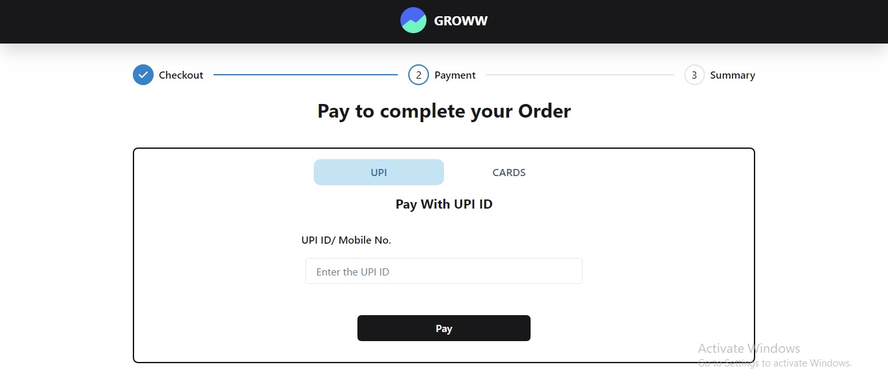

# Groww Cart: A Dynamic Shopping Experience

## Overview

This project is a Next.js application built with:

- Chakra UI: for component styling.
- Zustand: for state management.
- It simulates a dynamic checkout experience with:
- Randomized products and themes: Users encounter a unique product selection and theme upon opening the page.
- Clearable cache: A "reload" button allows users to refresh the cart state and theme.
  
## User Workflow

1. **Product and Theme Randomization:**

   - Upon opening the page, the user receives a random combination of products and a theme.
   - User can clear the cache and reload the cart state and theme by pressing the reload button

2. **Checkout Process:**

   - After selecting products, the user proceeds to checkout.

3.  **Payment Page:**

   - The user can switch between payment methods.

   Payment Method Validation:

- UPI: The entered string must end with "@upiHandle" (e.g., "oksbi@upiHandle", "axl@upiHandle").
- Credit Card:
  -- Validated using the Luhn algorithm.
  -- Requires a valid number for successful payment.
- CVV: Must be 3-4 numeric digits.
- Expiry Date: Validates for dates up to 12 years in the future.

4. **UPI Handling:**

   - If the chosen method is UPI, the entered string should end with "@upiHandle."
   - UPI handles are mapped based on information from the NPCI website (e.g., oksbi, axl).

5. **Credit Card Validation:**

   - The Luhn algorithm is applied to check the validity of the credit card number.
   - Only a valid credit card number allows successful payment.

6. **CVV Validation:**

   - CVV must consist of 3-4 numeric digits.

7. **Expiry Date Validation:**

   - Ensures the month and year can be up to 12 years in the future.

8. **Page Reload Handling:**

   - If the user reloads the page, a new set of random product and theme states are fetched.

9. **Payment Status Randomization:**
   - After successful payment, the transactionStatus is randomized.
   - Probability of success is 4/10.

## Tech Stack

- Next.js
- Chakra UI
- Zustand

## Preview

### Checkout Page

### Payment Options Page

### Order Confirmation Page

### Order Failed Page

### Mobile View

## Getting Started

### Prerequisites

- Node.js and npm installed on your machine.

### Installation

1. Clone the repository.
2. Navigate to the project directory.
3. Run `npm install` to install dependencies.
4. Run `npm run dev` to start the development server.

## License

This project is licensed under the [MIT License](LICENSE).
