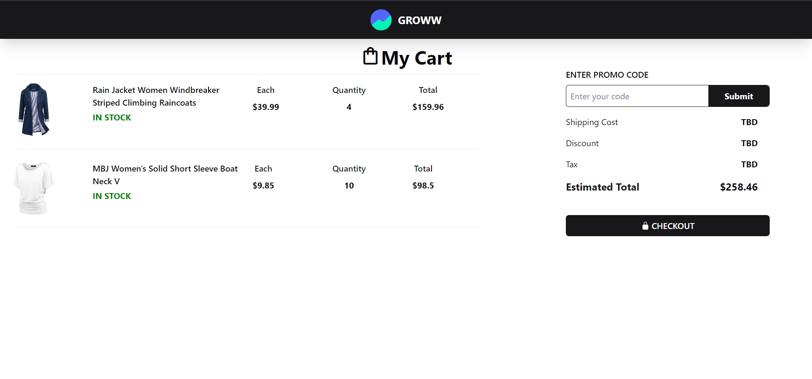
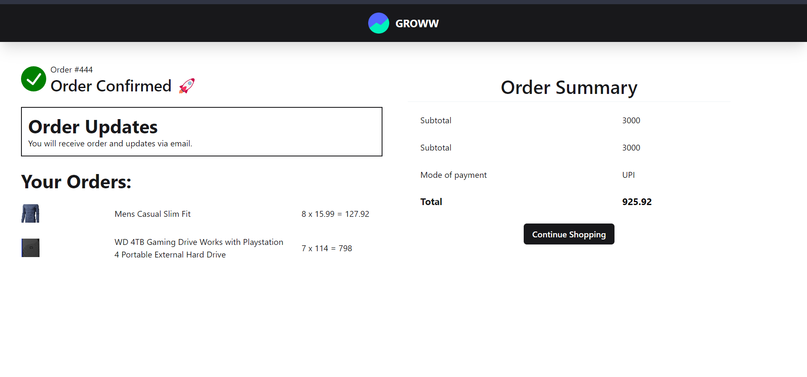
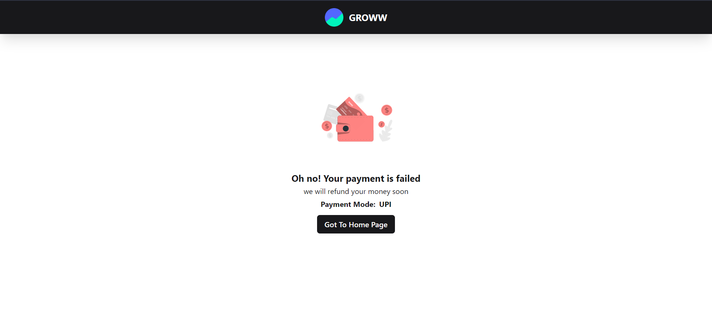
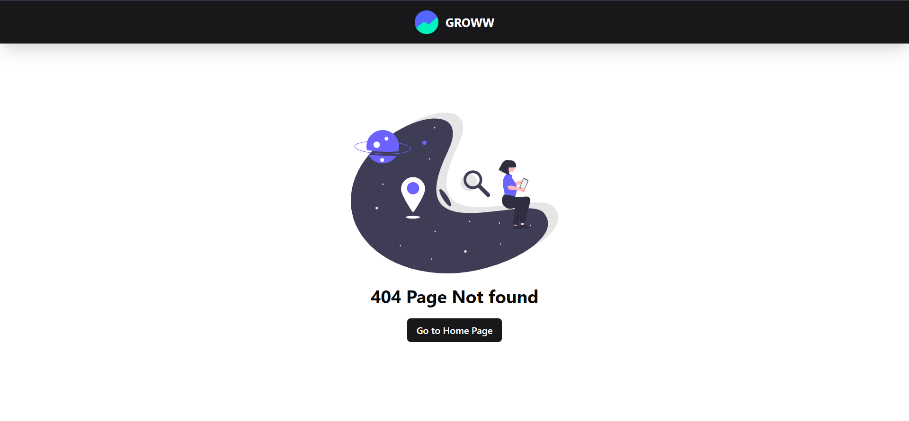

# Groww Cart

## Overview

This project is a React.js application that leverages Chakra UI for styling and Zustand for state management. It implements a dynamic checkout process with randomized products, themes, and payment status. The user can choose between different payment methods, including UPI and credit card. The project also features various validations, such as UPI handling, credit card validation using the Luhn algorithm, and more.

## User Workflow

1. **Product and Theme Randomization:**

   - Upon opening the page, the user receives a random combination of products and a theme.
   - User can clear the cache and reload the cart state and theme by pressing the reload button

2. **Checkout Process:**

   - After selecting products, the user proceeds to checkout.

3. **Payment Page:**

   - The user can switch between payment methods.

4. **UPI Handling:**

   - If the chosen method is UPI, the entered string should end with "@upiHandle."
   - UPI handles are mapped based on information from the NPCI website (e.g., oksbi, axl).

5. **Credit Card Validation:**

   - The Luhn algorithm is applied to check the validity of the credit card number.
   - Only a valid credit card number allows successful payment.

6. **CVV Validation:**

   - CVV must consist of 3-4 numeric digits.

7. **Expiry Date Validation:**

   - Ensures the month and year can be up to 12 years in the future.

8. **Page Reload Handling:**

   - If the user reloads the page, a new set of random product and theme states are fetched.

9. **Payment Status Randomization:**
   - After successful payment, the transactionStatus is randomized.
   - Probability of success is 4/10.

## Tech Stack

- React.js
- Chakra UI
- Zustand

## Preview

### Cart Page

### Payment Successful Page

### Payment Failed Page

### 404 Page

### Mobile View

## Getting Started

### Prerequisites

- Node.js and npm installed on your machine.

### Installation

1. Clone the repository.
2. Navigate to the project directory.
3. Run `npm install` to install dependencies.
4. Run `npm run dev` to start the development server.

## License

This project is licensed under the [MIT License](LICENSE).
